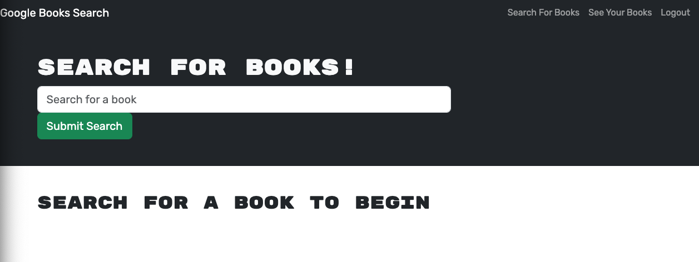

# book-search-engine

## Description

The Book Search Engine is a MERN application that allows you to search for a book through Google Books Search and save respective books to your logged in profile. You can view your books at a later time by logging in and clicking See Your Books.

I was able to demonstrate what I have learned throughout the Carleton University Full Stack Coding Bootcamp as well as use my researching skills to find and complete this program.

## Installation

You will need to install [node.JS](https://nodejs.org/en/download).

You will also have to install the package.json file through npm install.

## Usage

- You can view this application online or from downloading the application and running it through node.JS.
- You can login or sign up via the login/signup button.
- You can search for books in the Search For Books section. 
- You can save a book to your user by clicking "Save this Book!".
- You can view your saved books by clicking "See Your Books"
- You can delete a book from your user by clicking "Delete This Book!"
- You can visit the deployed app [here](https://mdeluca-text-editor-54b25a117244.herokuapp.com/).

## Credits

Base Code for HTML and CSS supplied by CARL-VIRT-FSF-PT-01-2023-U-LOLC GitLab Repository.

## License

The License used was the [MIT License](https://choosealicense.com/licenses/mit/). Also found in repository under LICENSE.

## Questions

If you have any questions, please reachout via [GitHub](https://github.com/mdeluca13/).